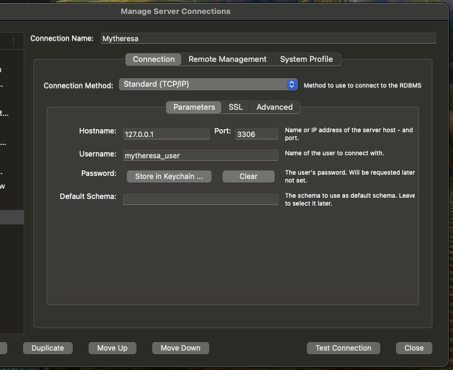

# Mytheresa Backend Restful API Assessments
We want you to implement a REST API endpoint that given a list of products, applies some discounts to them and can be filtered.
You are free to choose whatever language and tools you are most comfortable with. Please add instructions on how to run it and publish it in Github.

### What we expect
- Code structure/architecture must fit this use case, as simple or as complex needed to complete what is asked for.
- Tests are a must. Code must be testable without requiring networking or the filesystem. Tests should be runnable with 1 command.
- The project must be runnable with 1 simple command from any machine.
- Strongly advised to set it up via docker, both the sample application and the required infrastructure services that support it (mysql, postgress, redis, etc)
- Explanations on decisions taken

### Given this list of products:
```json
{
	"products": [
		{
			"sku": "000001",
			"name": "BV Lean leather ankle boots",
			"category": "boots",
			"price": 89000
		},
		{
			"sku": "000002",
			"name": "BV Lean leather ankle boots",
			"category": "boots",
			"price": 99000
		},
		{
			"sku": "000003",
			"name": "Ashlington leather ankle boots",
			"category": "boots",
			"price": 71000
		},
		{
			"sku": "000004",
			"name": "Naima embellished suede sandals",
			"category": "sandals",
			"price": 79500
		},
		{
			"sku": "000005",
			"name": "Nathane leather sneakers",
			"category": "sneakers",
			"price": 59000
		}
	]
}
```

You must take into account that this list could grow to have way more than 20.000 products, and it would be expected that it would remain performant.

The prices are integers for example, `100.00€` would be `10000`.

You can store the products as you see fit (json file, in memory, rdbms of choice)

### Given that:

- Products in the `boots` category have a 30% discount.
- The product with `sku` = `000003` has a 15% discount.
- When multiple discounts collide, the bigger discount must be applied.

Provide a single endpoint

## `GET /products`
- Can be filtered by `category` as a query string parameter
- (_optional_) Can be filtered by `priceLessThan` as a query string parameter, this filter applies before discounts are applied and will show products with prices lesser than or equal the value provided.
- Returns a list of `Product` with the given discounts applied when necessary
- Must return at most 5 elements. (The order does not matter)


### `Product` model
- `price.currency` is always `EUR`
- When a product does not have a discount, `price.final` and `price.original` should be the same number and `discount_percentage` should be null.
- When a product has a discount `price.original` is the original price, `price.final` is the amount with the discount applied and `discount_percentage` represents the applied discount with the `%` sign.

Example product with a discount of 30% applied.

```json
{
	"sku": "000001",
	"name": "BV Lean leather ankle boots",
	"category": "boots",
	"price": {
		"original": 89000,
		"final": 62300,
		"discount_percentage": "30%",
		"currency": "EUR"
	}
}
```

Example product without a discount
```json
{
	"sku": "000001",
	"name": "BV Lean leather ankle boots",
	"category": "boots",
	"price": {
		"original": 89000,
		"final": 89000,
		"discount_percentage": null,
		"currency": "EUR"
	}
}
```

## Exaplantion on Decisions Taken
During this task, I carefully considered the requirements and made deliberate decisions to ensure the implementation was clean, scalable, and maintainable. My approach was driven by my commitment to following best practices, adhering to `SOLID principles`, and creating a solution that is both functional and adaptable to future needs.

To start, I structured the project around `clean code architecture principles`. I created distinct layers, including `repositories`, `services`, and `DTOs`, to `separate concerns` and ensure each component had a `single responsibility`. For example, I used the ProductRepository to handle database queries, which allowed me to isolate the data layer from the business logic in the `ProductService`. This approach ensured that changes to the database or business logic could be made independently without causing ripple effects throughout the codebase.

I opted to use `DTOs`, such as `ProductDTO`, to transform raw data into a consistent and well-defined API response format. This decision was driven by my understanding of the importance of decoupling the database schema from API consumers. By encapsulating the transformation logic in DTOs, I made it easy to adjust the response format in the future without affecting the underlying database structure.

Scalability was a key focus for me. I implemented pagination to ensure the API could handle large datasets efficiently. Without pagination, a large number of products could overwhelm the server or slow down responses. Additionally, I introduced dynamic filtering by category and price, allowing users to query products more effectively. This approach not only improved performance but also made the API more user-friendly and versatile.

When implementing the discount logic, I deliberately chose a modular design. I created separate classes for `CategoryDiscount` and `SkuDiscount`, each handling its specific type of discount. This decision was guided by the `Open/Closed Principle`, as it allows for easy extension. For example, if a new type of discount is needed in the future, I can simply add a new class implementing the `DiscountInterface` without altering the existing ones. This approach ensures the system remains flexible and easy to extend.

I also focused on creating a consistent and developer-friendly API. I used the `ApiResponse trait` to standardize all API responses with fields like status, message, data, and meta. This decision ensures that both the frontend team and other developers consuming the API can rely on a predictable structure, which simplifies integration and debugging.

Test coverage was another area where I put a lot of effort. I wrote unit and feature tests for repositories, services, and DTOs to validate functionality and ensure that the application behaves as expected. For instance, I tested edge cases like filtering by a non-existent category or applying discounts to products without prices. These tests give me confidence that the application is robust and can handle unexpected inputs gracefully.

Maintainability was always on my mind. I configured constants like discount rates in a dedicated configuration file `(config/discounts.php)`, making updates simple and reducing the risk of introducing bugs. I also prioritized meaningful variable and method names, such as `getProducts`, `calculateDiscount`, and `discount_rate`, to make the code self-explanatory. By doing this, I ensured that any developer reviewing the code can understand its purpose without needing extensive documentation.

Error handling was another critical aspect. I implemented mechanisms to catch exceptions and provide user-friendly error messages while logging the details for debugging. For example, if a server error occurs while fetching products, the user receives a clear error message, and the technical details are logged for me or another developer to investigate.

Overall, I took this approach because I wanted to build a system that is not only functional today but also easy to maintain and extend in the future. Every decision, from separating concerns to writing comprehensive tests, was aimed at creating a scalable, clean, and professional solution.

# Installation and Setup Guideline

### Steps
- Ensure Docker Desktop is running on your Machine

- move into the project directory
```bash
cd mytheresa_api
```

- While in your project root directory, run this command
```sh
chmod +x setup.sh && ./setup.sh
```

- Connect to MYSQL Database using the credentials below




- Run seeder to have some data in the products table using this command below
```baah
./vendor/bin/sail php artisan db:seed --filter=ProductSeeder
```

## Run Tests
To run the application test, run the command below
```sh
./vendor/bin/sail php artisan test
```

## API Endpoint
`GET Request`
```bash
127.0.0.1:8080/api/products
```
